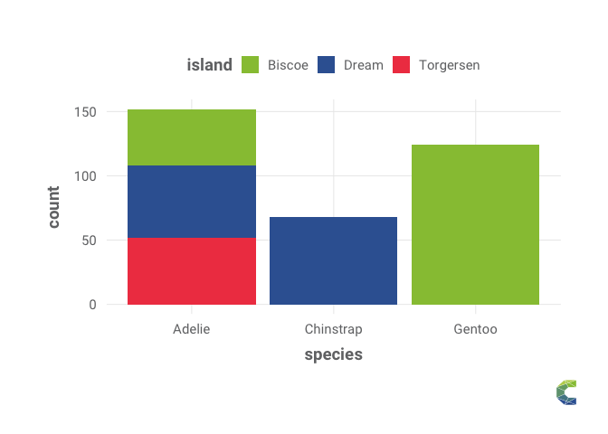

correltools
================

The {correltools} :package: aims to provide utility functions for useful
plots, analyses and tools in the CorrelAid context.

# Installation

``` r
remotes::install_github("correlaid/correltools")
```

# Features

## CorrelAidX map

``` r
library(correltools)
#first get the data from the website and using geocoding
chapters <- get_correlaidx_data()
```

    ## geocoding - this can take a couple of seconds

    ## No results found for "You want to know more about CorrelAid? Sign up for our Newsletter!".

    ## although coordinates are longitude/latitude, st_intersects assumes that they are planar
    ## although coordinates are longitude/latitude, st_intersects assumes that they are planar

``` r
correlaidx_map(chapters)
```

    ## Assuming "lon" and "lat" are longitude and latitude, respectively

    ## Warning in validateCoords(lng, lat, funcName): Data contains 1 rows with either
    ## missing or invalid lat/lon values and will be ignored

<!-- -->

Build a German version:

``` r
chapters_de <- get_correlaidx_data(lang = 'de')
```

    ## geocoding - this can take a couple of seconds

    ## No results found for "Du willst mehr über CorrelAid erfahren? Dann abonniere unseren Newsletter!".

    ## although coordinates are longitude/latitude, st_intersects assumes that they are planar
    ## although coordinates are longitude/latitude, st_intersects assumes that they are planar

``` r
correlaidx_map(chapters_de, lang = 'de')
```

    ## Assuming "lon" and "lat" are longitude and latitude, respectively

    ## Warning in validateCoords(lng, lat, funcName): Data contains 1 rows with either
    ## missing or invalid lat/lon values and will be ignored

<!-- -->

## ggplot theming

``` r
library(ggplot2)
library(correltools)
theme_set(theme_correlaid())
```

### Overall theme

The theme uses the Roboto fonts and has a generally minimal look:

``` r
simple_plot <- ggplot(penguins, aes(x = species, fill = island))+
  geom_bar()
simple_plot
```

<!-- -->

### color scales and palettes

``` r
simple_plot+
  scale_fill_correlaid_d()+
  add_correlaid_logo() # this needs to be the last line, otherwise might cause problems
```

<!-- -->

``` r
simple_plot+
  scale_fill_correlaid_d(option = "grey")+
  add_correlaid_logo()
```

<!-- -->

a somewhat more fancy plot with titles and subtitles:

``` r
ggplot(data = penguins, 
                       aes(x = flipper_length_mm,
                           y = body_mass_g)) +
  geom_point(aes(color = species, 
                 shape = species),
             size = 3,
             alpha = 0.8) +
  scale_color_correlaid_d()+
  labs(title = "Penguin size, Palmer Station LTER",
       subtitle = "Flipper length and body mass for Adelie, Chinstrap, and Gentoo Penguins",
       x = "Flipper length (mm)",
       y = "Body mass (g)",
       color = "Penguin species",
       shape = "Penguin species")+
  add_correlaid_logo()
```

    ## Warning: Removed 2 rows containing missing values (geom_point).

<!-- -->

continuous scale:

``` r
p <- ggplot(data = penguins, 
                       aes(x = bill_length_mm,
                           y = bill_depth_mm)) +
  geom_point(aes(color = body_mass_g),
             size = 3,
             alpha = 0.8) +
  theme_correlaid(base_size = 12)+ # smaller font size
  labs(title = "Penguin bills, Palmer Station LTER",
       subtitle = "Bill length, bill width and body mass",
       x = "Bill length (mm)",
       y = "Bill length (mm)",
       color = "Body mass (g)")

p+
  scale_color_correlaid_c(option = 'gradient_x')
```

    ## Warning: Removed 2 rows containing missing values (geom_point).

<!-- -->

we can also have a binned color scale:

``` r
p+
  scale_color_correlaid_b(option = 'gradient_x')
```

    ## Warning: Removed 2 rows containing missing values (geom_point).

<!-- -->

You can also manually construct color palettes that you can use in your
ggplots:

``` r
pal <- correlaid_pal(option = 'qualitative') # default qualitative
scales::show_col(pal(4))
```

<!-- -->

``` r
pal_cax <- correlaid_pal(option = 'gradient_x') # correlaidx
scales::show_col(pal_cax(9))
```

<!-- -->

``` r
pal_ca <- correlaid_pal(option = 'gradient', direction = -1) # correlaid, reversed order
scales::show_col(pal_ca(9))
```

<!-- -->

## CorrelCloud

`correltools` provides functions to make administrative tasks involving
the CorrelCloud - our Nextcloud instance - easier.

In order to do so, you will need to make your username and password
available as `CORRELCLOUD_USR` respectively `CORRELCLOUD_PWD`
environment variables (e.g. use `usethis::edit_r_environ()` to edit your
environment variables).

First, create a connection:

``` r
con <- new_correlcloud_con()
```

Notably, you can:

**create a new user (admin-only)**:

``` r
new_correlcloud_user(con, "Leo", "Muster", "leo@muster.de")
```

The default username will be {first name}{first letter of last name},
e.g. “LeoM”. If you want to override this behaviour, you can specify the
`user_id` argument:

``` r
new_correlcloud_user(con, "Leo", "Muster", "leo@muster.de", user_id = "LeoMu")
```

By default, users will not be added to any user groups, so they won’t
have access to any data/files. If you want to give them access, you can
specify a character vector to the `groups` argument.

``` r
new_correlcloud_user(con, "Leo", "Muster", "leo@muster.de", groups = c("User", "2021-01-TES"), user_id = "LeoMu")
```

**create a new group**:

``` r
new_correlcloud_group(con, "2022-01-TES")
```

**add a user to a group**:

``` r
add_correlcloud_user_to_group(con, "LeoM", "2022-01-TES")
```

Finally, you can **list users and groups** (admin rights required):

``` r
get_correlcloud_groups(con)
get_correlcloud_users(con)
```

## Contribute

Some mini-projects exist as
[issues](https://github.com/CorrelAid/correltools/issues). For each
issue there is a “get started” RMarkdown in `playground` with code how
to get example data that you can work with during development. If you
want to pick up an issue, just comment under it and you’ll be assigned!
:)

Depending on your skill levels, the contributing workflows could be as
follows:

#### no Git experience, no R package development experience

Prerequisites: you know how to work in R on your laptop, you know how to
work with R Markdown

1.  Download the repository as a zip (by clicking on the green “code”
    button and “download as zip”). Unzip the directory and double-click
    on the file `correltools.Rproj` to open the project in RStudio.
2.  work in the RMarkdown for your issue in the `playground` folder
3.  work until you have something that you think is cool.
4.  If you know how to write a R function, try to put your code into a
    function. If you don’t know about functions yet, you can read more
    about them [here](https://r4ds.had.co.nz/functions.html).

#### Git experience but no R package development experience

Prerequisites: you know about pull-commit-push and (optionally)
branching

1.  clone the repository (or fork it and work on your own copy and later
    make a pull request)
2.  make a branch for your issue (e.g. issue1-ggplot-theme). If you
    don’t know about branching, you can also work on the `main` branch.
    Ask Frie to add you as a contributor to the GitHub repo.
3.  work in the RMarkdown for your issue in the `playground` folder
4.  work until you have something that you think is cool. Commit
    whenever you feel you have made some progress.
5.  write a function that generates the output in your r markdown. (or
    multiple functions if necessary)
6.  write @frie a message on Slack for guidance and/or read into how you
    can possibly add your function to the R package by reading
    <https://r-pkgs.org/intro.html>

#### Git experience and R package development experience / good experience in R

Prerequisites: you know how to develop R packages (or you are confident
you can quickly learn about it by reading [R
packages](https://r4ds.had.co.nz/index.html)). You know how to fork
and/or how to work on Git branches (or you want to learn about it!).

1.  clone the repository (or fork it and work on your own copy and later
    make a pull request). If you choose the former, ask Frie to add you
    as a contributor to the GitHub repo.
2.  make a branch for your issue (e.g. issue1-ggplot-theme).
3.  work in the RMarkdown for your issue in the `playground` folder or
    directly work in `R` on your function. :)
4.  work until you have something that you think is cool. Commit
    whenever you feel you have made some progress.
5.  Make a PR if you’re ready :)
